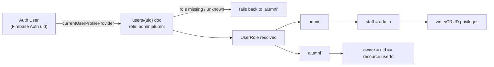
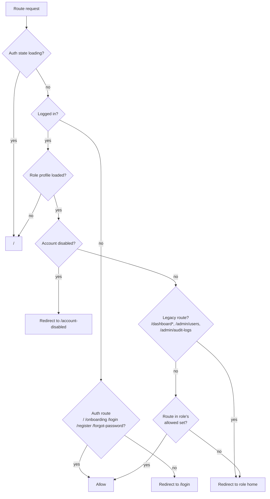
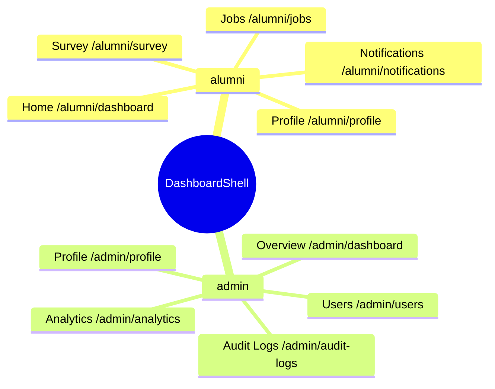
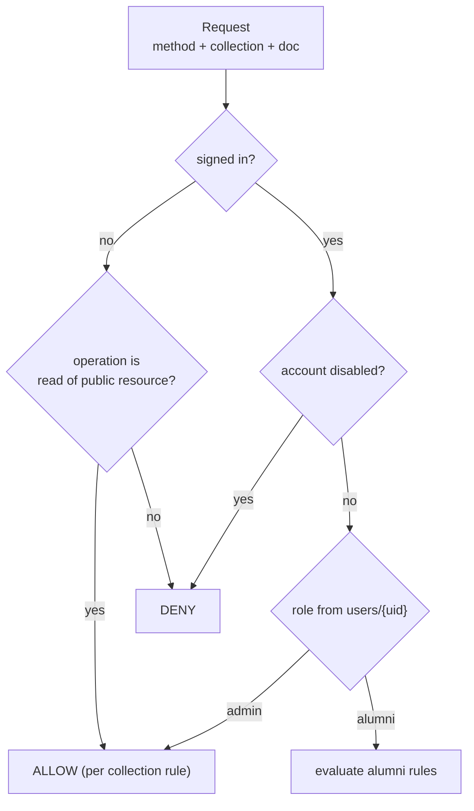
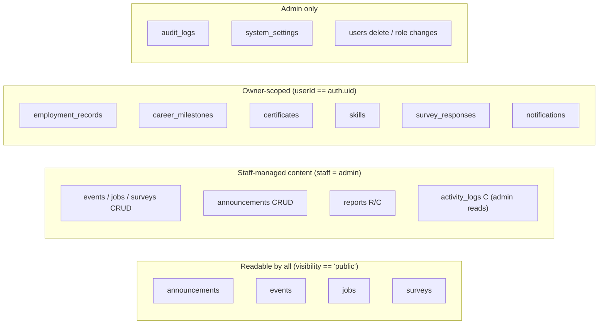

# GradTrack RBAC Architecture

Role-Based Access Control (RBAC) is enforced in **three layers**:

1. **Routing guard** — `frontend/lib/routes/app_router.dart` (role -> allowed route sets)
2. **UI enforcement** — `frontend/lib/providers/role_providers.dart` and widget guards
3. **Firestore security rules** — `backend/firestore.rules` (source of truth at data level)

The Firebase rules are the authoritative enforcement point. The client-side
guards only shape navigation and hide UI affordances.

---

## 1. Identity & role model

Roles are stored on the `users/{uid}` document as the string field `role`
(`frontend/lib/models/user_model.dart`):

```dart
enum UserRole { admin, alumni }
```

| Role | Label | Description |
|---|---|---|
| `admin` | Administrator | Full control: users, analytics, audit logs, system settings |
| `alumni` | Alumni | Own profile, employment, documents, browse public content |

Derived terms used throughout the codebase and rules:

- **staff** = `admin`
- **signed-in** = has auth AND account not disabled
- **owner** = signed-in AND `auth.uid == resource.userId`



### Account lifecycle gates

- `disabled: true` on the user doc -> user is locked to `/account-disabled`
  (`isNotDisabled` in rules; `profile?.disabled` in the router).
- `emailVerified` / `isVerified` are tracked but do not gate routing; they gate
  verify actions in the admin UI.

---

## 2. Route access map (client routing guard)

Guard: `routerProvider` redirect function in `frontend/lib/routes/app_router.dart`.



Role homes (`dashboardForRole`):

| Role | Home |
|---|---|
| alumni | `/alumni/dashboard` |
| admin | `/admin/dashboard` |

### Route allow matrix

`/staff/data/:key` is available to **every** signed-in role, but only for
keys registered in the `contentCollections` registry
(`frontend/lib/screens/shared/collection_list_screen.dart`); an unknown key
renders `_NotFoundScreen`.

| Route | alumni | admin |
|---|---|---|
| `/alumni/dashboard`, `/alumni/survey`, `/alumni/jobs`, `/alumni/notifications`, `/alumni/profile`, `/alumni/documents` | ✅ | ❌ |
| `/profile`, `/profile/edit`, `/employment`, `/employment/add`, `/documents/resume`, `/documents/certificates` | ✅ | ✅ (profile only) |
| `/admin/dashboard`, `/admin/users`, `/admin/analytics`, `/admin/audit-logs`, `/admin/profile` | ❌ | ✅ |
| `/staff/users` | ❌ | ✅ |
| `/staff/data/:key` | ✅ | ✅ |

⚠️ exceptions:
- `/editProfile` is allowed for admin; `/profile` is allowed for alumni and admin.
- Any other route for a logged-in role -> redirected to that role's home.

### Shell navigation per role (bottom nav / sidebar)



---

## 3. Firestore security rules map

Source: `backend/firestore.rules`. Helper functions:

| Helper | Meaning |
|---|---|
| `isAdmin()` | role == `admin` |
| `isStaff()` | same as `isAdmin()` (kept for readability) |
| `isAlumni()` | signed-in AND role != `admin` (legacy coordinator/guest docs treated as alumni) |
| `ownerOfResource()` / `canOwnUpdate()` / `canOwnCreate()` | signed-in AND `auth.uid == resource.userId` |
| `isPublicResource()` | `visibility == 'public'` |
| `canPublishContent()` | payload has `title` AND `visibility` in `[public, private]` |



### Operations matrix

Legend: `R` read · `C` create · `U` update · `D` delete · `–` denied.

| Collection | alumni | admin |
|---|---|---|
| `users` | self: R, C (role alumni), U (role unchanged) | R C U D |
| `employment_records` | owner: R C U D | R U D |
| `career_milestones` | owner: R C U D | R U D |
| `certificates` | owner: R C U D | R U D |
| `skills` | owner: R C U D | R U D |
| `surveys` | R if public | C U D (publish valid) |
| `survey_responses` | owner: R C U | R; D |
| `announcements` | R | C U D (publish valid) |
| `events` | R | C U D (publish valid) |
| `jobs` | R | C U D (publish valid) |
| `event_registrations` | owner: R C D | R D |
| `notifications` | owner: R C U D | R C U D |
| `reports` | – | R C; D; U always denied |
| `activity_logs` | – | R; C |
| `audit_logs` | – | R C (write-only, no U/D) |
| `system_settings` | – | R C U D |
| `conversations` | participant: R C U D | participant: R C U D |
| `messages` | any signed-in: R; own: C (U/D always denied) | same |

Notes:

- `messages` reads allow any signed-in user; creation requires
  `auth.uid == message.userId`.
- `users` self-update cannot change `role` or `disabled`; self-create is limited
  to the `alumni` role (this is how alumni self-register).
- Reports and audit/log collections are effectively append-only
  (`update/delete` hard-denied).



---

## 4. UI enforcement layer

`frontend/lib/providers/role_providers.dart` exposes derived booleans:

| Provider | True when |
|---|---|
| `currentUserRoleProvider` | current profile role (null while loading) |
| `isAdminProvider` | role == admin |
| `isStaffProvider` | role == admin |
| `isAlumniProvider` | role == alumni |

Where role checks are applied in the UI:

| Location | Check | Effect |
|---|---|---|
| `DashboardShell._navItemsForRole` | role switch | Builds per-role nav items |
| `routerProvider.redirect` | route allow sets | Blocks unauthorized navigation |
| `CollectionListScreen` | `publicOnly` (role null) | Unknown roles only see `visibility == 'public'` docs; Add/Edit/Delete only for staff |
| `collectionContentsProvider` | `publicOnly` | Adds `where('visibility', isEqualTo: 'public')` to the query |
| `UserManagementScreen` | `roleFilter` + `canVerify` | Admin can manage users; verification for alumni |
| `ProfileScreen` / `EmploymentHistoryPage` etc. | `isStaff` | Staff read-only views of alumni records, alumni get edit affordances |
| `ThemeToggleButton` / FAB rows | `isStaff && !publicOnly` | Staff-only Add button overlay on content lists |

> UI hiding is **not** security — every restricted action is still re-checked by
> the Firestore rules in layer 3.

---

## 5. RACI-style capability summary

| Capability | alumni | admin |
|---|---|---|
| Browse public announcements/events/jobs/surveys | ✅ | ✅ |
| Publish content (surveys, events, jobs, announcements) | ❌ | ✅ |
| Complete own profile & employment records | ✅ | ❌ (via profile) |
| Read all alumni records | ❌ | ✅ |
| Manage users | ❌ | ✅ |
| View analytics | ❌ | ✅ |
| View audit logs | ❌ | ✅ |
| Change system settings | ❌ | ✅ |
| Delete users | ❌ | ✅ |

### Cross-cutting rules

- **Never trust the client:** all checks repeat in `firestore.rules`.
- **Ownership** is expressed by writing `userId` on documents at create time,
  then matching `auth.uid` on read/update.
- **Role escalation** requires an `admin` update; self-create is limited to the
  `alumni` role, and self-update cannot touch `role`.
- **Disabled accounts** are revoked at every layer: routing redirect,
  `isNotDisabled()` in every rules helper.